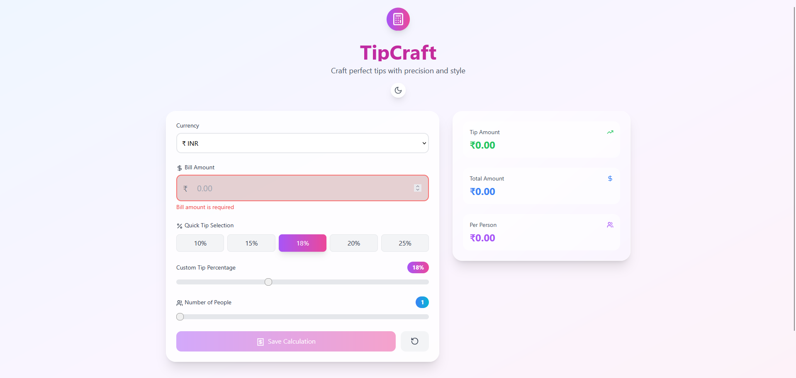
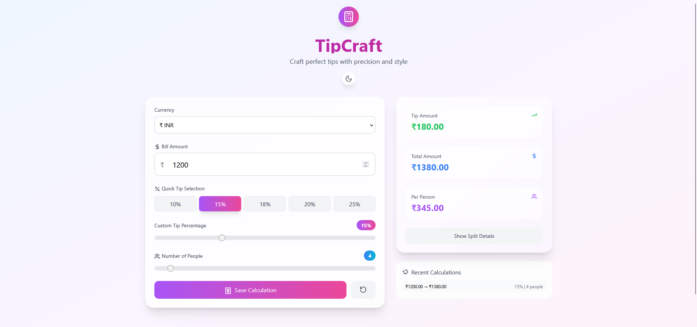

# TipCraft - Advanced Tip Calculator

A smart and interactive Tip Calculator built with **React** and **Tailwind CSS**. TipCraft offers a modern UI, theme switching, currency selection, and real-time calculations.

## 🚀 Live Demo

[TipCraft - Advanced Tip Calculator](https://tip-craft.vercel.app/)

## ✨ Features

- Responsive and clean UI
- Auto calculation on input
- Theme switch (light/dark)
- Multi-currency selection
- Clear/reset functionality

## 🛠 Tech Stack

- React
- Tailwind CSS
- JavaScript

## 📸 Screenshots

### Interface



### Result



## 📦 Installation

1. Clone the repository:

   ```bash
   git clone https://github.com/maheshhattimare/TipCraft.git
   ```

2. Navigate to the project folder:

   ```bash
   cd TipCraft
   ```

3. Install dependencies:

   ```bash
   npm install
   ```

4. Run the app:

   ```bash
   npm run dev
   ```

5. Visit: [http://localhost:5173](http://localhost:5173)
